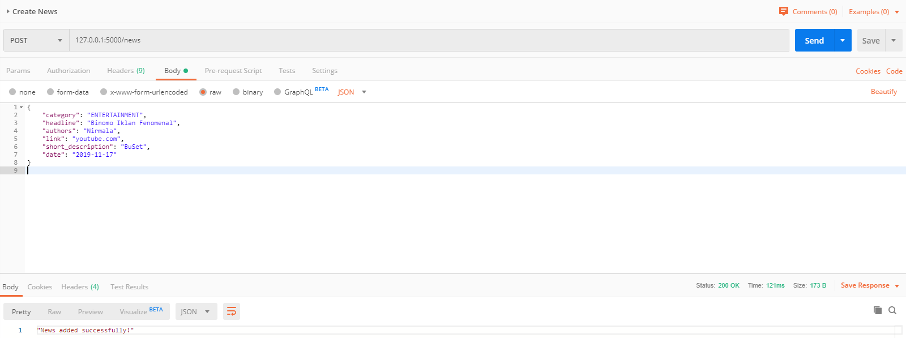
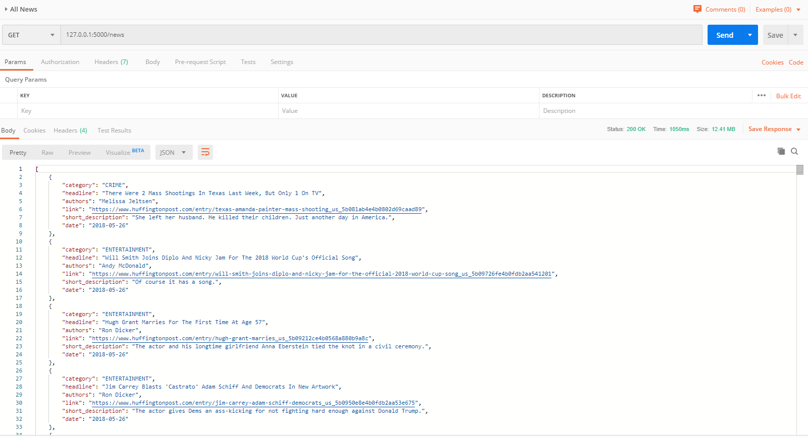
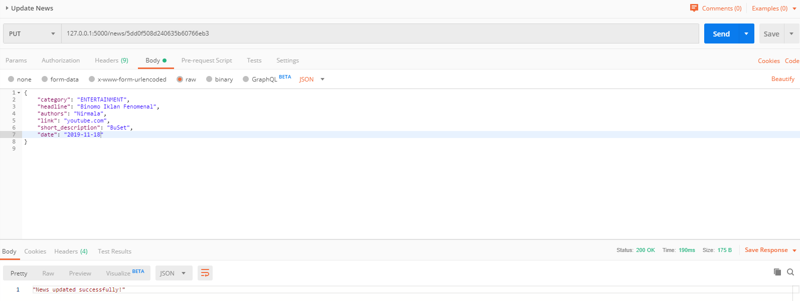
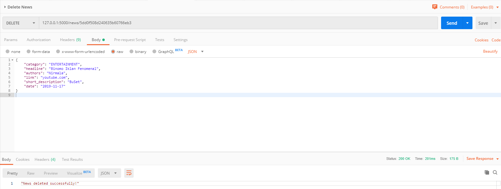
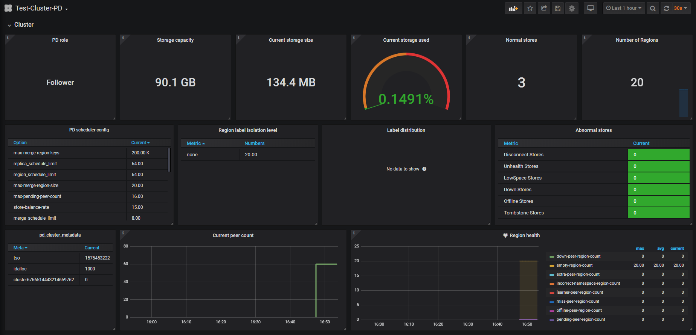
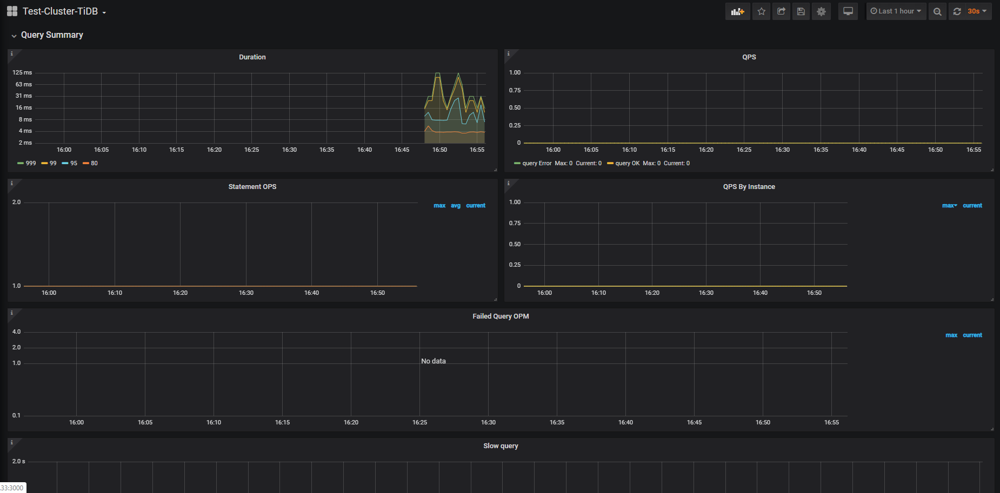
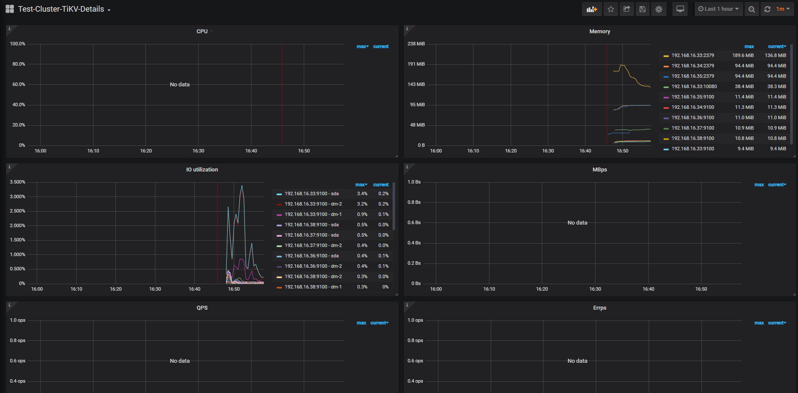

### Tugas EAS Basis Data Terdistribusi
# Implementasi Infrastruktur TiDB Cluster
Ferdinand Jason Gondowijoyo (05111640000033)

## Table of Contents
- [Implementasi Infrastruktur TiDB Cluster](#implementasi-infrastruktur-tidb-cluster)
  - [Table of Contents](#table-of-contents)
  - [Deskripsi Tugas](#deskripsi-tugas)
  - [Implementasi Arsitektur TiDB](#implementasi-arsitektur-tidb)
    - [Desain Arsitektur TiDB](#desain-arsitektur-tidb)
    - [Implementasi menggunakan Vagrant](#implementasi-menggunakan-vagrant)
  - [Pemanfaatan Basis Data dalam Aplikasi CRUD](#pemanfaatan-basis-data-dalam-aplikasi-crud)
    - [Aplikasi Create](#aplikasi-create)
    - [Aplikasi Read](#aplikasi-read)
    - [Aplikasi Update](#aplikasi-update)
    - [Aplikasi Delete](#aplikasi-delete)
  - [Uji Performa Aplikasi](#uji-performa-aplikasi)
    - [Uji menggunakan JMeter](#uji-menggunakan-jmeter)
    - [Uji menggunakan Sysbench](#uji-menggunakan-sysbench)
    - [Uji Fail Over](#uji-fail-over)
  - [Monitoring menggunakan Grafana](#monitoring-menggunakan-grafana)
    - [Menginstall Node Exporter, Prometheus, dan Grafana](#menginstall-node-exporter-prometheus-dan-grafana)
    - [Konfigurasi Grafana](#konfigurasi-grafana)
    - [Import Dashboard Grafana](#import-dashboard-grafana)
    - [Hasil Dashboard Grafana](#hasil-dashboard-grafana)

## Deskripsi Tugas
1. Implementasi Arsitektur Sistem Basis Data Terdistribusi
   - MySQL CLuster
   - TiDB
2. Pemanfaatan basis data terdistribusi dalam aplikasi ( nilai: 20 )
   - Aplikasi CMS atau API
3. Uji performa aplikasi dan basis data
   - Aplikasi -> JMeter
   - Basis Data -> Sysbench
4. Tambahkan monitoring dashboard menggunakan Grafana.
5. Dokumentasi

## Implementasi Arsitektur TiDB
### Desain Arsitektur TiDB
1. Gambar Infrastruktur\

2. Penjelasan\
Terdapat 6 Server yang digunakan pada Tugas EAS dengan pembagian IP dan Spesifikasinya sebagai berikut :
|          |                     Node 1                    |       Node 2      |       Node 3      |        Node 4       |        Node 5       | Node 6              |
|:--------:|:---------------------------------------------:|:-----------------:|:-----------------:|:-------------------:|:-------------------:|---------------------|
| Aplikasi | PD, TiDB, node exporter,  Grafana, Prometheus | PD, node exporter | PD, node exporter | TiKV, node exporter | TiKV, node exporter | TiKV, node exporter |
| OS       | CentOS 7                                      | CentOS 7          | CentOS 7          | CentOS 7            | CentOS 7            | CentOS 7            |
| RAM      | `512` MB                                      | `512` MB          | `512` MB          | `512` MB            | `512` MB            | `512` MB            |
| IP       | 192.168.16.33                                 | 192.168.16.34     | 192.168.16.35     | 192.168.16.36       | 192.168.16.37       | 192.168.16.38       |

### Implementasi menggunakan Vagrant
1. Membuat Vagrantfile
    Vagrantfile dapat dibuat dengan mengetikkan
    ```bash
    vagrant init
    ```
    Setelah melakukan perintah tersebut, maka `Vagrantfile` terbuat pada direktori tempat perintah tersebut dijalankan.
2. Memodifikasi Vagrantfile tersebut menjadi
   ```ruby
    Vagrant.configure("2") do |config|
        (1..6).each do |i|
            config.vm.define "node#{i}" do |node|
                node.vm.hostname = "node#{i}"

                # Gunakan CentOS 7 dari geerlingguy yang sudah dilengkapi VirtualBox Guest Addition
                node.vm.box = "geerlingguy/centos7"
                node.vm.box_version = "1.2.19"
                
                # Disable checking VirtualBox Guest Addition agar tidak compile ulang setiap restart
                node.vbguest.auto_update = false
                
                node.vm.network "private_network", ip: "192.168.16.#{32+i}"
                
                node.vm.provider "virtualbox" do |vb|
                    vb.name = "node#{i}"
                    vb.gui = false
                    vb.memory = "512"
                end

                node.vm.provision "shell", path: "provision/bootstrap.sh", privileged: false
            end
        end
    end
    
   ```
   Vagrantfile tersebut akan membuat 6 node dengan script provision : `provision/bootstrap.sh`
3. Membuat script provision : `provision/bootstrap.sh`
   ```bash
    # Referensi:
    # https://pingcap.com/docs/stable/how-to/deploy/from-tarball/testing-environment/

    # Update the repositories
    # sudo yum update -y

    # Copy open files limit configuration
    sudo cp /vagrant/config/tidb.conf /etc/security/limits.d/

    # Enable max open file
    sudo sysctl -w fs.file-max=1000000

    # Copy atau download TiDB binary dari http://download.pingcap.org/tidb-v3.0-linux-amd64.tar.gz
    cp /vagrant/installer/tidb-v3.0-linux-amd64.tar.gz .

    # Extract TiDB binary
    tar -xzf tidb-v3.0-linux-amd64.tar.gz

    # Install MariaDB to get MySQL client
    sudo yum -y install mariadb

    # Install Git
    sudo yum -y install git

    # Install nano text editor
    sudo yum -y install nano

    # Install node exporter
    wget https://github.com/prometheus/node_exporter/releases/download/v0.18.1/node_exporter-0.18.1.linux-amd64.tar.gz
    tar -xzf node_exporter-0.18.1.linux-amd64.tar.gz

   ```
4. Menjalankan Vagrant
- Setelah membuat `Vagrantfile` serta segala file yang dibutuhkan. maka vagrant virtual box bisa dijalankan dengan
     ```bash
     vagrant up
     ```
5. Konfigurasi TiDB
- Masuk kedalam Node 1 dengan perintah `vagrant ssh node1`, jalankan perintah berikut
    ```bash
    cd tidb-v3.0-linux-amd64
    ./bin/pd-server --name=pd1 \
                    --data-dir=pd \
                    --client-urls="http://192.168.16.33:2379" \
                    --peer-urls="http://192.168.16.33:2380" \
                    --initial-cluster="pd1=http://192.168.16.33:2380,pd2=http://192.168.16.34:2380,pd3=http://192.168.16.35:2380" \
                    --log-file=pd.log &
    ```
- Masuk kedalam Node 2 dengan perintah `vagrant ssh node2`, jalankan perintah berikut
    ```bash
    cd tidb-v3.0-linux-amd64
    ./bin/pd-server --name=pd2 \
                    --data-dir=pd \
                    --client-urls="http://192.168.16.34:2379" \
                    --peer-urls="http://192.168.16.34:2380" \
                    --initial-cluster="pd1=http://192.168.16.33:2380,pd2=http://192.168.16.34:2380,pd3=http://192.168.16.35:2380" \
                    --log-file=pd.log &

    ```
- Masuk kedalam Node 3 dengan perintah `vagrant ssh node3`, jalankan perintah berikut
    ```bash
    cd tidb-v3.0-linux-amd64
    ./bin/pd-server --name=pd2 \
                    --data-dir=pd \
                    --client-urls="http://192.168.16.34:2379" \
                    --peer-urls="http://192.168.16.34:2380" \
                    --initial-cluster="pd1=http://192.168.16.33:2380,pd2=http://192.168.16.34:2380,pd3=http://192.168.16.35:2380" \
                    --log-file=pd.log &

    ```
- Masuk kedalam Node 4 dengan perintah `vagrant ssh node4`, jalankan perintah berikut
    ```bash
    cd tidb-v3.0-linux-amd64
    ./bin/tikv-server --pd="192.168.16.33:2379,192.168.16.34:2379,192.168.16.35:2379" \
                    --addr="192.168.16.36:20160" \
                    --data-dir=tikv \
                    --log-file=tikv.log &
    ```
- Masuk kedalam Node 5 dengan perintah `vagrant ssh node5`, jalankan perintah berikut
    ```bash
    cd tidb-v3.0-linux-amd64
    ./bin/tikv-server --pd="192.168.16.33:2379,192.168.16.34:2379,192.168.16.35:2379" \
                    --addr="192.168.16.36:20160" \
                    --data-dir=tikv \
                    --log-file=tikv.log &
    ```
- Masuk kedalam Node 6 dengan perintah `vagrant ssh node6`, jalankan perintah berikut
    ```bash
    cd tidb-v3.0-linux-amd64
    ./bin/tikv-server --pd="192.168.16.33:2379,192.168.16.34:2379,192.168.16.35:2379" \
                    --addr="192.168.16.36:20160" \
                    --data-dir=tikv \
                    --log-file=tikv.log &
    ```
- Masuk kedalam Node 1 dengan perintah `vagrant ssh node1`, jalankan perintah berikut
    ```bash
    cd tidb-v3.0-linux-amd64
    ./bin/tidb-server --store=tikv \
                    --path="192.168.16.33:2379" \
                    --log-file=tidb.log &
    ```


## Pemanfaatan Basis Data dalam Aplikasi CRUD
Aplikasi yang dibuat memanfaatkan dataset yang digunakan dalam tugas Mongo dengan sedikit modifikasi dan pengurangan jumlah dataset yang dimasukkan ke dalam TiDB.
Aplikasi dapat dilihat di [sini](api/rest.py)

### Aplikasi Create

### Aplikasi Read

### Aplikasi Update

### Aplikasi Delete


## Uji Performa Aplikasi

### Uji menggunakan JMeter
### Uji menggunakan Sysbench
Hasil uji coba `sysbench` dapat dilihat dilihat pada file 
- 1 PD -> [point_select_run_100_1.log](sysbench/point_select_run_100_1.log)
    ```
    SQL statistics:
        queries performed:
            read:                            2322807
            write:                           0
            other:                           0
            total:                           2322807
        transactions:                        2322807 (7741.62 per sec.)
        queries:                             2322807 (7741.62 per sec.)
        ignored errors:                      0      (0.00 per sec.)
        reconnects:                          0      (0.00 per sec.)

    General statistics:
        total time:                          300.0401s
        total number of events:              2322807

    Latency (ms):
            min:                                    0.59
            avg:                                   12.91
            max:                                  147.40
            95th percentile:                       25.28
            sum:                             29996286.63

    Threads fairness:
        events (avg/stddev):           23228.0700/49.09
        execution time (avg/stddev):   299.9629/0.02


    ```
- 2 PD -> [point_select_run_100_2.log](sysbench/point_select_run_100_2.log)
    ```
    SQL statistics:
        queries performed:
            read:                            2537554
            write:                           0
            other:                           0
            total:                           2537554
        transactions:                        2537554 (8456.82 per sec.)
        queries:                             2537554 (8456.82 per sec.)
        ignored errors:                      0      (0.00 per sec.)
        reconnects:                          0      (0.00 per sec.)

    General statistics:
        total time:                          300.0584s
        total number of events:              2537554

    Latency (ms):
            min:                                    0.55
            avg:                                   11.82
            max:                                  173.52
            95th percentile:                       21.50
            sum:                             29997462.63

    Threads fairness:
        events (avg/stddev):           25375.5400/56.34
        execution time (avg/stddev):   299.9746/0.00


    ```
- 3 PD -> [point_select_run_100_3.log](sysbench/point_select_run_100_3.log)
    ```
    SQL statistics:
        queries performed:
            read:                            2770945
            write:                           0
            other:                           0
            total:                           2770945
        transactions:                        2770945 (9235.65 per sec.)
        queries:                             2770945 (9235.65 per sec.)
        ignored errors:                      0      (0.00 per sec.)
        reconnects:                          0      (0.00 per sec.)

    General statistics:
        total time:                          300.0259s
        total number of events:              2770945

    Latency (ms):
            min:                                    0.54
            avg:                                   10.82
            max:                                   67.40
            95th percentile:                       18.95
            sum:                             29990636.22

    Threads fairness:
        events (avg/stddev):           27709.4500/57.30
        execution time (avg/stddev):   299.9064/0.04

    ```

Kesimpulan :\
Semakin banyak PD yang digunakan performa read meningkat, tetapi tidak meningkat secara signifikan.

### Uji Fail Over

## Monitoring menggunakan Grafana
### Menginstall Node Exporter, Prometheus, dan Grafana
- Masuk kedalam Node 1 dengan perintah `vagrant ssh node1`, jalankan perintah berikut
    ```bash
    cd node_exporter-0.18.1.linux-amd64
    ./node_exporter --web.listen-address=":9100" \
        --log.level="info" &
    ```
- Masuk kedalam Node 2 dengan perintah `vagrant ssh node2`, jalankan perintah berikut
    ```bash
    cd node_exporter-0.18.1.linux-amd64
    ./node_exporter --web.listen-address=":9100" \
        --log.level="info" &
    ```
- Masuk kedalam Node 3 dengan perintah `vagrant ssh node3`, jalankan perintah berikut
    ```bash
    cd node_exporter-0.18.1.linux-amd64
    ./node_exporter --web.listen-address=":9100" \
        --log.level="info" &
    ```
- Masuk kedalam Node 4 dengan perintah `vagrant ssh node4`, jalankan perintah berikut
    ```bash
    cd node_exporter-0.18.1.linux-amd64
    ./node_exporter --web.listen-address=":9100" \
        --log.level="info" &
    ```
- Masuk kedalam Node 5 dengan perintah `vagrant ssh node5`, jalankan perintah berikut
    ```bash
    cd node_exporter-0.18.1.linux-amd64
    ./node_exporter --web.listen-address=":9100" \
        --log.level="info" &
    ```
- Masuk kedalam Node 6 dengan perintah `vagrant ssh node6`, jalankan perintah berikut
    ```bash
    cd node_exporter-0.18.1.linux-amd64
    ./node_exporter --web.listen-address=":9100" \
        --log.level="info" &
    ```
- Masuk kedalam Node 1 dengan perintah `vagrant ssh node1`, jalankan perintah berikut
    ```bash
    wget https://github.com/prometheus/prometheus/releases/download/v2.2.1/prometheus-2.2.1.linux-amd64.tar.gz
    wget https://dl.grafana.com/oss/release/grafana-6.5.1.linux-amd64.tar.gz

    tar -xzf prometheus-2.2.1.linux-amd64.tar.gz
    tar -zxf grafana-6.5.1.linux-amd64.tar.gz
    ```
    Kemudian mengganti `prometheus.yml` menjadi sebagai berikut :
    ```yaml
    global:
        scrape_interval:     15s  # By default, scrape targets every 15 seconds.
        evaluation_interval: 15s  # By default, scrape targets every 15 seconds.
        # scrape_timeout is set to the global default value (10s).
        external_labels:
            cluster: 'test-cluster'
            monitor: "prometheus"

    scrape_configs:
    - job_name: 'overwritten-nodes'
        honor_labels: true  # Do not overwrite job & instance labels.
        static_configs:
        - targets:
        - '192.168.16.33:9100'
        - '192.168.16.34:9100'
        - '192.168.16.35:9100'
        - '192.168.16.36:9100'
        - '192.168.16.37:9100'
        - '192.168.16.38:9100'

    - job_name: 'tidb'
        honor_labels: true  # Do not overwrite job & instance labels.
        static_configs:
        - targets:
        - '192.168.16.33:10080'

    - job_name: 'pd'
        honor_labels: true  # Do not overwrite job & instance labels.
        static_configs:
        - targets:
        - '192.168.16.33:2379'
        - '192.168.16.34:2379'
        - '192.168.16.35:2379'

    - job_name: 'tikv'
        honor_labels: true  # Do not overwrite job & instance labels.
        static_configs:
        - targets:
        - '192.168.16.36:20180'
        - '192.168.16.37:20180'
        - '192.168.16.38:20180'
    ```
    Kemudian menjalankan `prometheus` dengan mengetikan
    ```bash
    cd ~
    cd prometheus-2.2.1.linux-amd64
    ./prometheus \
        --config.file="./prometheus.yml" \
        --web.listen-address=":9090" \
        --web.external-url="http://192.168.16.33:9090/" \
        --web.enable-admin-api \
        --log.level="info" \
        --storage.tsdb.path="./data.metrics" \
        --storage.tsdb.retention="15d" &

    ```
    Setelah itu menambahkan `grafana.ini` dengan mengetikkan
    ```bash
    cd .. && cd grafana-6.5.1
    nano conf/grafana.ini
    ```
    ```ini
    [paths]
    data = ./data
    logs = ./data/log
    plugins = ./data/plugins
    [server]
    http_port = 3000
    domain = 192.168.16.33
    [database]
    [session]
    [analytics]
    check_for_updates = true
    [security]
    admin_user = admin
    admin_password = admin
    [snapshots]
    [users]
    [auth.anonymous]
    [auth.basic]
    [auth.ldap]
    [smtp]
    [emails]
    [log]
    mode = file
    [log.console]
    [log.file]
    level = info
    format = text
    [log.syslog]
    [event_publisher]
    [dashboards.json]
    enabled = false
    path = ./data/dashboards
    [metrics]
    [grafana_net]
    url = https://grafana.net
    ```
    Setelah itu menjalankan Grafana dengan mengetikkan
    ```bash
    ./bin/grafana-server \
        --config="./conf/grafana.ini" &
    ```
### Konfigurasi Grafana
Konfigurasi Grafana dapat dilakukan dengan masuk kedalam `192.168.16.33:3000`
masuk dengan menggunakan username `admin` dan password `admin`

Klik logo Grafana, dan klik Data Source, dan klik Add data source, dan tuliskan informasi dari prometheus.

### Import Dashboard Grafana
KLik logo Grafana, dan klik Dashboard, dan Import.
Klik Upload .json File untuk upload JSON file yang dapat dilihat pada [link](https://github.com/pingcap/tidb-ansible/tree/master/scripts).

Pada tugas ini, saya menggunakan tiga dashboard yaitu `pd.json`, `tidb.json`, dan `tikv_details.json`.

### Hasil Dashboard Grafana




