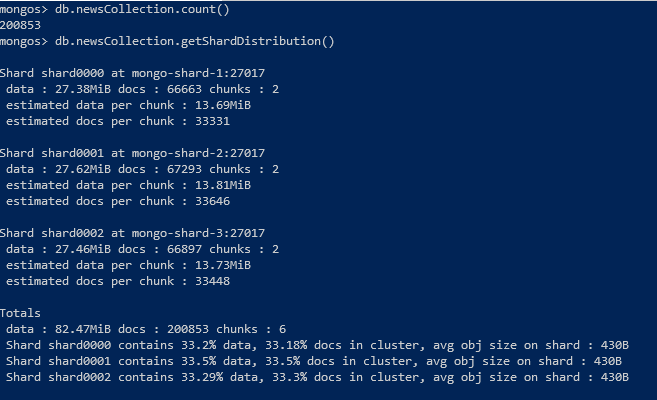
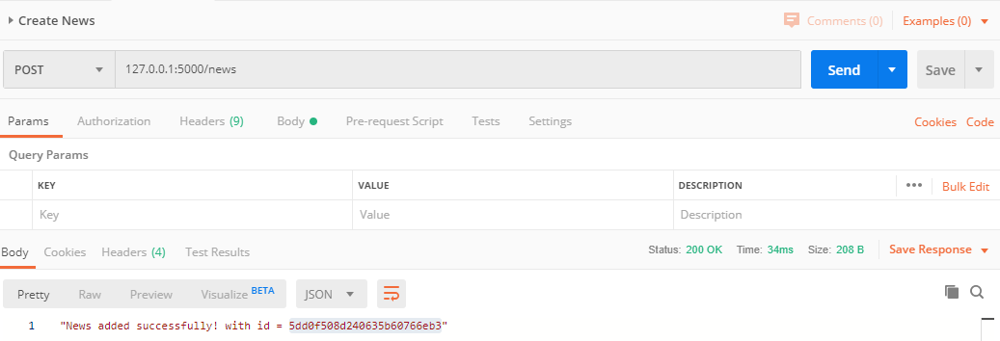
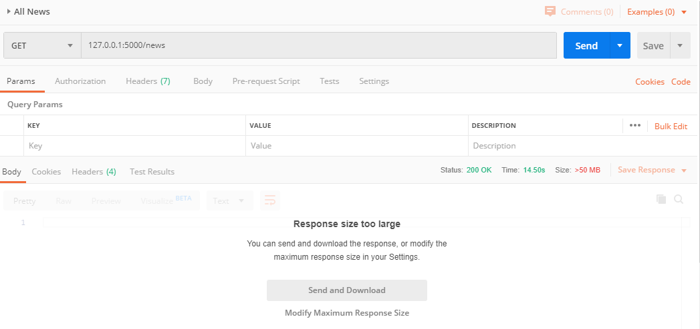
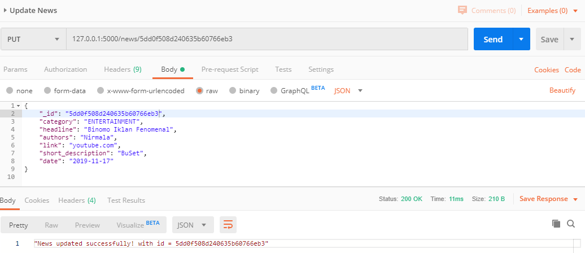
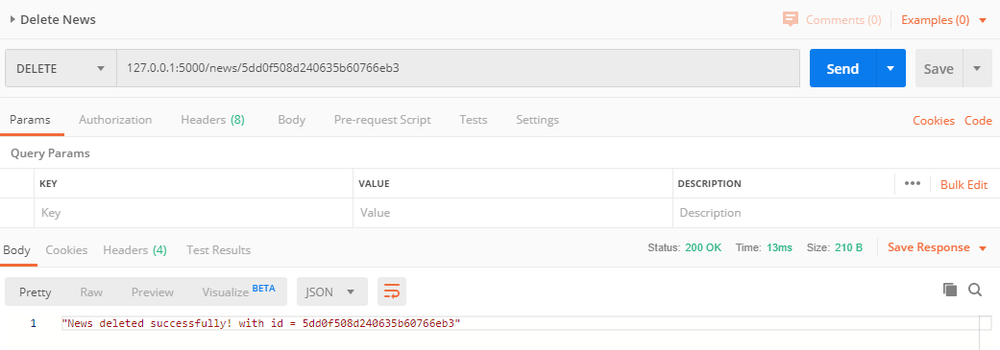
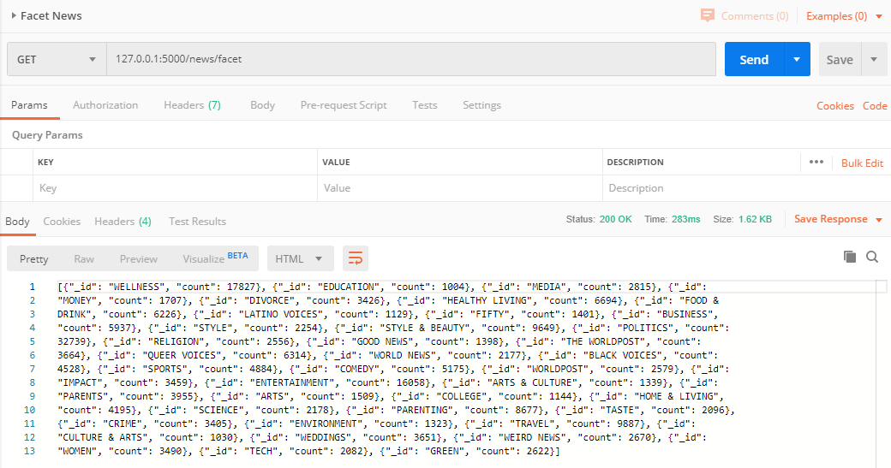

### Tugas Implementasi MongoDB Basis Data Terdistribusi
# Implementasi MongoDB Cluster
Ferdinand Jason Gondowijoyo 

- [Implementasi MongoDB Cluster](#implementasi-mongodb-cluster)
  - [Deskripsi Tugas](#deskripsi-tugas)
  - [Implementasi MongoDB Cluster](#implementasi-mongodb-cluster-1)
  - [Konfigurasi MongoDB Cluster](#konfigurasi-mongodb-cluster)
  - [Import Data dan Hasil](#import-data-dan-hasil)
  - [API](#api)
    - [Create](#create)
    - [Read](#read)
    - [Update](#update)
    - [Delete](#delete)
    - [Aggregation](#aggregation)

## Deskripsi Tugas
1. Implementasi Cluster MongoDB
   - Menggunakan versi MongoDB: 4.2
   - Dapat menggunakan Vagrant/Docker
   - Cluster terdiri dari:
     - Config server: 2
     - Data/shard server: 3
     - Query router: 1
2. Menggunakan dataset
   - Menggunakan dataset berformat CSV atau JSON dengan ukuran > 1000 baris
   - Import ke dalam server MongoDB
3. Implementasi aplikasi CRUD
   - Menggunakan bahasa pemrograman yang support dengan connector MongoDB
   - Menggunakan Web/API/Scripting
   - Harus ada operasi CRUD
   - Untuk proses read, harus melibatkan juga agregasi
     - Minimal ada 2 contoh query agregasi

## Implementasi MongoDB Cluster
1. Terdapat beberapa server yang digunakan pada Tugas ini, dengan pembagian IP dan spesifikasinya sebagai berikut:
   - Server Config:
     - `mongo-config-1` :
       - OS: `ubuntu-18.04`
       - RAM: `512` MB
       - IP: `192.168.2.2`
     - `mongo-config-2` :
       - OS: `ubuntu-18.04`
       - RAM: `512` MB
       - IP: `192.168.2.3`
   - Query Router:
     - `mongo-query-router` :
       - OS: `ubuntu-18.04`
       - RAM: `512` MB
       - IP: `192.168.2.4`
   - Server Data/Shard:
     - `mongo-shard-1` :
       - OS: `ubuntu-18.04`
       - RAM: `512` MB
       - IP: `192.168.2.5`
     - `mongo-shard-2` :
       - OS: `ubuntu-18.04`
       - RAM: `512` MB
       - IP: `192.168.2.6`
     - `mongo-shard-3` :
       - OS: `ubuntu-18.04`
       - RAM: `512` MB
       - IP: `192.168.2.7`
2. Implementasi Vagrant
   1. Membuat `Vagrantfile` \
      Vagrantfile dapat dibuat dengan mengetikkan
      ```bash
      vagrant init
      ```
      Setelah melakukan perintah tersebut, maka `Vagrantfile` terbuat pada direktori tempat perintah tersebut dijalankan.  
   2. Memodifikasi `Vagrantfile` tersebut menjadi sebagai berikut
      ```ruby
        # -*- mode: ruby -*-
        # vi: set ft=ruby :

        Vagrant.configure("2") do |config|

        (1..2).each do |i|
            config.vm.define "mongo_config_#{i}" do |node|
            node.vm.hostname = "mongo-config-#{i}"
            node.vm.box = "bento/ubuntu-18.04"
            node.vm.network "private_network", ip: "192.168.2.#{i+1}"

            node.vm.provider "virtualbox" do |vb|
                vb.name = "mongo-config-#{i}"
                vb.gui = false
                vb.memory = "512"
            end

            node.vm.provision "shell", path: "bash/mongo_config_#{i}.sh", privileged: false
            end
        end

        config.vm.define "mongo_query_router" do |mongo_query_router|
            mongo_query_router.vm.hostname = "mongo-query-router"
            mongo_query_router.vm.box = "bento/ubuntu-18.04"
            mongo_query_router.vm.network "private_network", ip: "192.168.2.4"
            
            mongo_query_router.vm.provider "virtualbox" do |vb|
                vb.name = "mongo-query-router"
                vb.gui = false
                vb.memory = "512"
            end

            mongo_query_router.vm.provision "shell", path: "bash/mongo_router.sh", privileged: false
        end

        (1..3).each do |i|
            config.vm.define "mongo_shard_#{i}" do |node|
            node.vm.hostname = "mongo-shard-#{i}"
            node.vm.box = "bento/ubuntu-18.04"
            node.vm.network "private_network", ip: "192.168.2.#{4+i}"
                
            node.vm.provider "virtualbox" do |vb|
                vb.name = "mongo-shard-#{i}"
                vb.gui = false
                vb.memory = "512"
            end

            node.vm.provision "shell", path: "bash/mongo_shard_#{i}.sh", privileged: false
            end
        end

        end      
      ```

3. Membuat Script Provision
   1. Script Provision untuk semua host : `allhosts.sh`
        ```bash
        # Add hostname
        sudo cp /vagrant/sources/hosts /etc/hosts

        # Copy APT sources list
        sudo cp '/vagrant/sources/sources.list' '/etc/apt/'
        sudo cp '/vagrant/sources/mongodb.list' '/etc/apt/sources.list.d/'

        sudo apt-key adv --keyserver hkp://keyserver.ubuntu.com:80 --recv 4B7C549A058F8B6B

        # Update Repository
        sudo apt-get update
        # sudo apt-get upgrade -y

        # Install MongoDB
        sudo apt-get install -y mongodb-org

        # Error handling (?)
        sudo mkdir -p /var/run/mongodb
        sudo touch /var/run/mongodb/mongod.pid
        sudo chown -R  mongodb:mongodb /var/run/mongodb/
        sudo chown mongodb:mongodb /var/run/mongodb/mongod.pid

        # Start MongoDB
        sudo service mongod start
        ```
   2. Script Provision untuk `mongo-config-1`
        ```bash
        sudo bash /vagrant/bash/allhosts.sh

        # Override mongod config with current config
        sudo cp /vagrant/config/mongodcsvr1.conf /etc/mongod.conf

        # Restart the mongo service 
        sudo systemctl restart mongod
        ```
   3. Script Provision untuk `mongo-config-2`
        ```bash
        sudo bash /vagrant/bash/allhosts.sh

        # Override mongod config with current config
        sudo cp /vagrant/config/mongodcsvr2.conf /etc/mongod.conf

        # Restart the mongo service 
        sudo systemctl restart mongod

        ```
   4. Script Provision untuk `mongo-query-router`
        ```bash
        sudo bash /vagrant/bash/allhosts.sh

        # Override mongod config with current config
        sudo cp /vagrant/config/mongos.conf /etc/mongos.conf

        # Create new service file
        sudo touch /lib/systemd/system/mongos.service
        sudo cp /vagrant/service/mongos.service /lib/systemd/system/mongos.service

        # Stop current mongo service
        sudo systemctl stop mongod

        # Enable mongos.service
        sudo systemctl enable mongos.service
        sudo systemctl start mongos

        # Confirm mongos is running
        systemctl status mongos

        ```
   5. Script Provision untuk `mongo-shard-1`
        ```bash
        sudo bash /vagrant/bash/allhosts.sh

        # Override mongod config with current config
        sudo cp /vagrant/config/mongodshardsvr1.conf /etc/mongod.conf

        # Restart the mongo service 
        sudo systemctl restart mongod
        ```
   6. Script Provision untuk `mongo-shard-2`
        ```bash
        sudo bash /vagrant/bash/allhosts.sh

        # Override mongod config with current config
        sudo cp /vagrant/config/mongodshardsvr2.conf /etc/mongod.conf

        # Restart the mongo service 
        sudo systemctl restart mongod
        ```
   7. Script Provision untuk `mongo-shard-3`
        ```bash
        sudo bash /vagrant/bash/allhosts.sh

        # Override mongod config with current config
        sudo cp /vagrant/config/mongodshardsvr3.conf /etc/mongod.conf

        # Restart the mongo service 
        sudo systemctl restart mongod
        ```

4. Membuat File Konfigurasi
   1. File Konfigurasi `mongo-config-1` : `mongodcsvr1.conf`
        ```ini
        # mongod.conf

        # for documentation of all options, see:
        #   http://docs.mongodb.org/manual/reference/configuration-options/

        # where to write logging data.
        systemLog:
          destination: file
          logAppend: true
          path: /var/log/mongodb/mongod.log

        # Where and how to store data.
        storage:
          dbPath: /var/lib/mongodb
          journal:
            enabled: true
        #  engine:
        #  wiredTiger:

        # how the process runs
        processManagement:
          timeZoneInfo: /usr/share/zoneinfo

        # network interfaces
        net:
          port: 27019
          bindIp: 192.168.2.2

        #security:

        #operationProfiling:

        replication:
          replSetName: configReplSet

        sharding:
          clusterRole: "configsvr"
        
        ## Enterprise-Only Options

        #auditLog:

        #snmp:
        ```
   2. File Konfigurasi `mongo-config-2` : `mongodcsvr2.conf`
        ```ini
        # mongod.conf

        # for documentation of all options, see:
        #   http://docs.mongodb.org/manual/reference/configuration-options/

        # where to write logging data.
        systemLog:
          destination: file
          logAppend: true
          path: /var/log/mongodb/mongod.log

        # Where and how to store data.
        storage:
          dbPath: /var/lib/mongodb
          journal:
            enabled: true
        #  engine:
        #  wiredTiger:

        # how the process runs
        processManagement:
          timeZoneInfo: /usr/share/zoneinfo

        # network interfaces
        net:
          port: 27019
          bindIp: 192.168.2.3


        #security:
        #  keyFile: /opt/mongo/mongodb-keyfile

        #operationProfiling:

        replication:
          replSetName: configReplSet

        sharding:
          clusterRole: "configsvr"
        
        ## Enterprise-Only Options

        #auditLog:

        #snmp:
        
        ```
   3. File Konfigurasi `mongo-query-router` : `mongos.conf`
        ```ini
        # where to write logging data.
        systemLog:
          destination: file
          logAppend: true
          path: /var/log/mongodb/mongos.log

        # network interfaces
        net:
          port: 27017
          bindIp: 192.168.2.4

        sharding:
          configDB: configReplSet/mongo-config-1:27019,mongo-config-2:27019
        ```
   4. File Konfigurasi `mongo-shard-1` : `mongodshardsvr1.conf`
        ```ini
        # mongod.conf

        # for documentation of all options, see:
        #   http://docs.mongodb.org/manual/reference/configuration-options/

        # where to write logging data.
        systemLog:
          destination: file
          logAppend: true
          path: /var/log/mongodb/mongod.log

        # Where and how to store data.
        storage:
          dbPath: /var/lib/mongodb
          journal:
            enabled: true
        #  engine:
        #  wiredTiger:

        # how the process runs
        processManagement:
          timeZoneInfo: /usr/share/zoneinfo

        # network interfaces
        net:
          port: 27017
          bindIp: 192.168.2.5


        #security:

        #operationProfiling:

        #replication:

        sharding:
        clusterRole: "shardsvr"
        
        ## Enterprise-Only Options

        #auditLog:

        #snmp:
        ```
   5. File Konfigurasi `mongo-shard-2` : `mongodshardsvr2.conf`
        ```ini
        # mongod.conf

        # for documentation of all options, see:
        #   http://docs.mongodb.org/manual/reference/configuration-options/

        # where to write logging data.
        systemLog:
          destination: file
          logAppend: true
          path: /var/log/mongodb/mongod.log

        # Where and how to store data.
        storage:
          dbPath: /var/lib/mongodb
          journal:
            enabled: true
        #  engine:
        #  wiredTiger:

        # how the process runs
        processManagement:
          timeZoneInfo: /usr/share/zoneinfo

        # network interfaces
        net:
          port: 27017
          bindIp: 192.168.2.6


        #security:

        #operationProfiling:

        #replication:

        sharding:
          clusterRole: "shardsvr"
        
        ## Enterprise-Only Options

        #auditLog:

        #snmp:
        ```
   6. File Konfigurasi `mongo-shard-3` : `mongodshardsvr3.conf`
        ```ini
        # mongod.conf

        # for documentation of all options, see:
        #   http://docs.mongodb.org/manual/reference/configuration-options/

        # where to write logging data.
        systemLog:
          destination: file
          logAppend: true
          path: /var/log/mongodb/mongod.log

        # Where and how to store data.
        storage:
          dbPath: /var/lib/mongodb
          journal:
            enabled: true
        #  engine:
        #  wiredTiger:

        # how the process runs
        processManagement:
          timeZoneInfo: /usr/share/zoneinfo

        # network interfaces
        net:
          port: 27017
          bindIp: 192.168.2.7


        #security:

        #operationProfiling:

        #replication:

        sharding:
          clusterRole: "shardsvr"
        
        ## Enterprise-Only Options

        #auditLog:

        #snmp:
        ```
5. Membuat File Tambahan
   1. Membuat `/vagrant/sources/hosts`
        ```
        192.168.2.2 mongo-config-1
        192.168.2.3 mongo-config-2
        192.168.2.4 mongo-query-router
        192.168.2.5 mongo-shard-1
        192.168.2.6 mongo-shard-2
        192.168.2.7 mongo-shard-3
        ```
   2. Membuat file service `mongos.service`
        ```ini
        [Unit]
        Description=Mongo Cluster Router
        After=network.target

        [Service]
        User=mongodb
        Group=mongodb
        ExecStart=/usr/bin/mongos --config /etc/mongos.conf
        # file size
        LimitFSIZE=infinity
        # cpu time
        LimitCPU=infinity
        # virtual memory size
        LimitAS=infinity
        # open files
        LimitNOFILE=64000
        # processes/threads
        LimitNPROC=64000
        # total threads (user+kernel)
        TasksMax=infinity
        TasksAccounting=false

        [Install]
        WantedBy=multi-user.target
        ```


## Konfigurasi MongoDB Cluster
1. Konfigurasi Replica Set
    1. Masuk kedalam salah satu server config
        Masuk kedalam server `vagrant-config-1`
        ```bash
        vagrant ssh mongo_config_1
        ```
        Masuk kedalam mongo
        ```
        mongo mongo-config-1:27019
        ```
    2. Init replica set
        Initialisasi replica set dapat dilakukan dengan mengetikkan 
        ```
        rs.initiate( { _id: "configReplSet", configsvr: true, members: [ { _id: 0, host: "mongo-config-1:27019" }, { _id: 1, host: "mongo-config-2:27019" }] } )
        ```
    3. Check hasil replica set
        Pengecekkan replica set dapat dilakukan dengan mengetikkan
        ```
        rs.status()
        ```
2. Membuat user administrative
    1. Masuk kedalam salah satu server config
        Masuk kedalam server `vagrant-config-1`
        ```bash
        vagrant ssh mongo_config_1
        ```
        Masuk kedalam mongo
        ```
        mongo mongo-config-1:27019
        ```
    2. Conect kedalam database `admin`
        Pada `mongo` shell ketikan
        ```
        use admin
        ```
    3. Membuat user
        ```
        db.createUser({user: "mongo-admin", pwd: "password", roles:[{role: "root", db: "admin"}]})
        ```
3. Menambahkan shard kedalam MongoDB Cluster
    1. Masuk kedalam salah satu server shard
        Masuk kedalam server `vagrant-shard-1`
        ```bash
        vagrant ssh mongo_shard_1
        ```
    2. Connect ke MongoDB Query Router `mongo-query-router`
        ```bash
        mongo mongo-query-router:27017 -u mongo-admin -p --authenticationDatabase admin
        ```
    3. Menambahkan shard
        Dari shell `mongo` ketikkan
        ```bash
        sh.addShard( "mongo-shard-1:27017" )
        sh.addShard( "mongo-shard-2:27017" )
        sh.addShard( "mongo-shard-3:27017" )
        ```
4. Mengaktifkan sharding pada database dan koleksi
    1. Masuk kedalam salah satu server shard
        Masuk kedalam server `vagrant-shard-1`
        ```bash
        vagrant ssh mongo_shard_1
        ```
    2. Connect ke MongoDB Query Router `mongo-query-router`
        ```bash
        mongo mongo-query-router:27017 -u mongo-admin -p --authenticationDatabase admin
        ```
    3. Membuat database
        Pada shell `mongo` ketikkan
        ```bash
        use news
        sh.enableSharding("news")
        db.newsCollection.ensureIndex( { _id : "hashed" } )
        sh.shardCollection( "news.newsCollection", { "_id" : "hashed" } )
        ```

## Import Data dan Hasil
1. Mengimport data `dataset` kedalam MongoDB Cluster
    Pada tugas ini, saya menggunakan program python untuk parsing pada file dan memasukkan data satu persatu, detail program dapat dilihat pada [Python](api/insert_data.py)
2. Hasil import data
    Pada `mongo` shell di server query ketikkan : 
    ```
    db.newsCollection.count()
    db.newsCollection.getShardDistribution()
    ```
    Maka akan didapatkan hasil sebagai berikut :
    


## API
Percobaan menggunakan REST API yang dibuat berdasarkan Flask (Python).
### Create
Endpoint untuk fungsi ini adalah `POST /news`, berikut hasilnya.


### Read
Endpoint untuk fungsi ini adalah `GET /news`, berikut hasilnya.


### Update
Endpoint untuk fungsi ini adalah `PUT /news/<id>`, berikut hasilnya.


### Delete
Endpoint untuk fungsi ini adalah `DELETE /news/<id>`, berikut hasilnya.


### Aggregation
Endpoint untuk fungsi ini adalah `GET /news/facet`, berikut hasilnya.

```json
[
    {"_id": "WELLNESS", "count": 17827}, 
    {"_id": "EDUCATION", "count": 1004}, 
    {"_id": "MEDIA", "count": 2815}, 
    {"_id": "MONEY", "count": 1707}, 
    {"_id": "DIVORCE", "count": 3426}, 
    {"_id": "HEALTHY LIVING", "count": 6694}, 
    {"_id": "FOOD & DRINK", "count": 6226}, 
    {"_id": "LATINO VOICES", "count": 1129}, 
    {"_id": "FIFTY", "count": 1401}, 
    {"_id": "BUSINESS", "count": 5937}, 
    {"_id": "STYLE", "count": 2254}, 
    {"_id": "STYLE & BEAUTY", "count": 9649},
    {"_id": "POLITICS", "count": 32739}, 
    {"_id": "RELIGION", "count": 2556}, 
    {"_id": "GOOD NEWS", "count": 1398},
    {"_id": "THE WORLDPOST", "count": 3664}, 
    {"_id": "QUEER VOICES", "count": 6314}, 
    {"_id": "WORLD NEWS", "count": 2177}, 
    {"_id": "BLACK VOICES", "count": 4528}, 
    {"_id": "SPORTS", "count": 4884}, 
    {"_id": "COMEDY", "count": 5175}, 
    {"_id": "WORLDPOST", "count": 2579}, 
    {"_id": "IMPACT", "count": 3459},
    {"_id": "ENTERTAINMENT", "count": 16058}, 
    {"_id": "ARTS & CULTURE", "count": 1339}, 
    {"_id": "PARENTS", "count": 3955}, 
    {"_id": "ARTS", "count": 1509}, 
    {"_id": "COLLEGE", "count": 1144},
    {"_id": "HOME & LIVING", "count": 4195}, 
    {"_id": "SCIENCE", "count": 2178}, 
    {"_id": "PARENTING", "count": 8677}, 
    {"_id": "TASTE", "count": 2096},
    {"_id": "CRIME", "count": 3405}, 
    {"_id": "ENVIRONMENT", "count": 1323}, 
    {"_id": "TRAVEL", "count": 9887}, 
    {"_id": "CULTURE & ARTS", "count": 1030}, 
    {"_id": "WEDDINGS", "count": 3651}, 
    {"_id": "WEIRD NEWS", "count": 2670}, 
    {"_id": "WOMEN", "count": 3490}, 
    {"_id": "TECH", "count": 2082}, 
    {"_id": "GREEN", "count": 2622}
]
```